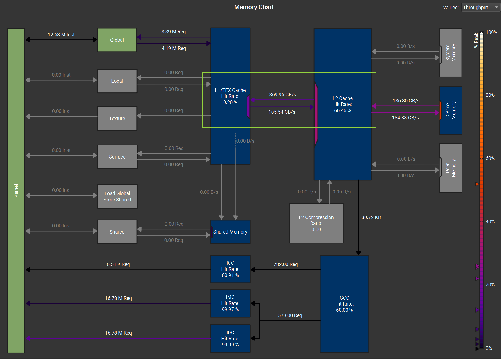
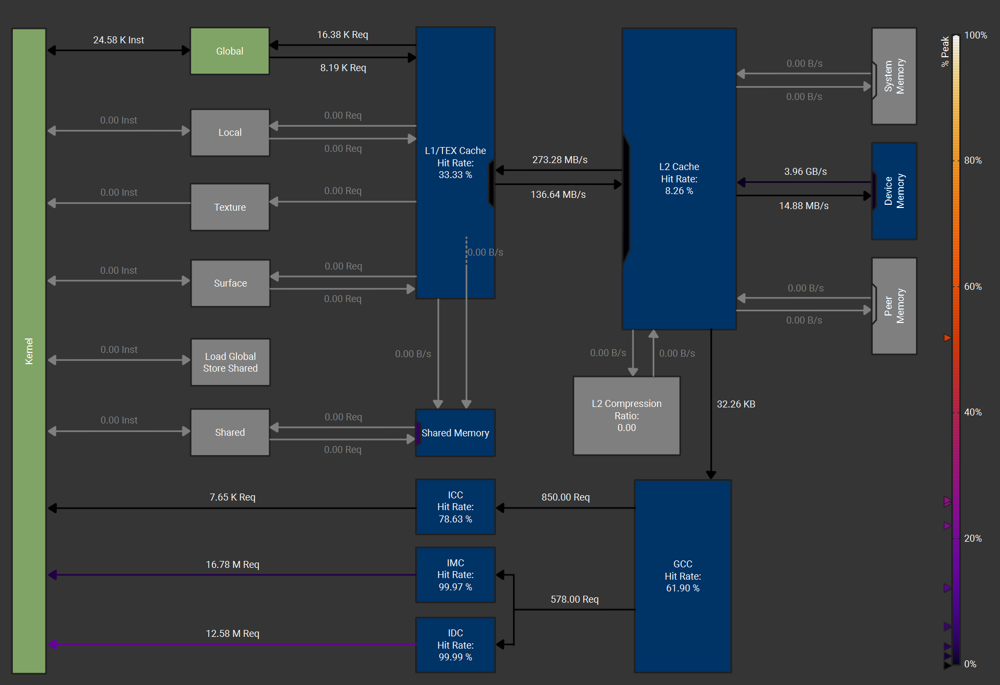
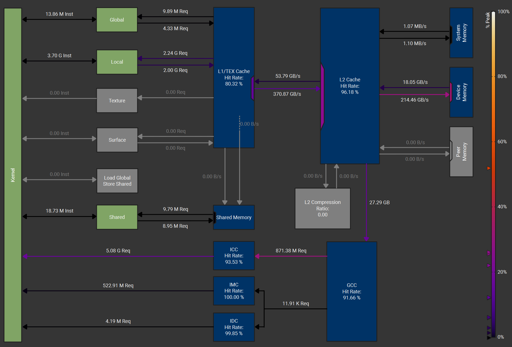
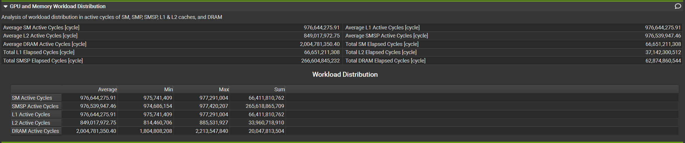

CUDA Stream Compaction
======================

**University of Pennsylvania, CIS 565: GPU Programming and Architecture, Project 2**

* Jiangman(Lobi) Zhao
  * [Lobi Zhao - LinkedIn](https://www.linkedin.com/in/lobizhao/), [Lobi Zhao - personal website](https://lobizhao.github.io/).
* Tested on: Windows 11 Pro, i5-10600KF @ 4.10GHz 32GB, RTX 3080 10GB

### Features

#### **CPU Implementation**
- **Function**: `StreamCompaction::CPU::scan()`
- **Implementation**: Simple iterative prefix sum
  ```cpp
  for (int i = 1; i < n; i++) {
      odata[i] = odata[i-1] + idata[i-1];
  }
  ```
- **Complexity**: O(n) time

#### **Naive GPU Implementation**
- **Direct parallelization** of inclusive scan
- **Function**: `StreamCompaction::Naive::scan()`
- **Kernel**: `naiveScan<<<gridSize, blockSize>>>()`
- **Implementation**: Each thread reads from previous elements
  ```cpp
  // Each iteration d, thread reads from distance 2^(d-1)
  if (index >= dOffset) {
      odata[index] = idata[index] + idata[index - dOffset];
  }
  ```
- **Complexity**: O(n log n) work, log n depth

#### **Work-Efficient GPU Implementation**
- **Tree-based scan** with up-sweep and down-sweep phases
- **Functions**: `StreamCompaction::Efficient::scan()`, `scanOnGpu()`
- **Kernels**: `upSweep<<<>>>()`, `downSweep<<<>>>()`
- **Implementation**:
  - **Up-sweep (Reduce)**: Build sum tree bottom-up
    ```cpp
    data[k + (1<<(d+1)) - 1] += data[k + (1<<d) - 1];
    ```
  - **Down-sweep (Distribute)**: Propagate sums top-down
    ```cpp
    int temp = data[k + (1<<d) - 1];
    data[k + (1<<d) - 1] = data[k + (1<<(d+1)) - 1];
    data[k + (1<<(d+1)) - 1] += temp;
    ```
- **Complexity**: O(n) work, log n depth
- **Key optimization**: `scanOnGpu()` keeps data on GPU throughout process

#### **Thrust Implementation**
- **Function**: `StreamCompaction::Thrust::scan()`
- **Implementation**: `thrust::exclusive_scan()`
- **Features**: Production-quality, hardware-specific optimizations

#### **Stream Compaction**
- **Map-Scan-Scatter workflow** for removing zero elements
- **Function**: `StreamCompaction::Efficient::compact()`
- **Kernels**: `kernMapToBoolean<<<>>>()`, `kernScatter<<<>>>()`
- **Implementation**:
  1. **Map**: `kernMapToBoolean()` converts elements to boolean flags
     ```cpp
     bools[index] = (idata[index] != 0) ? 1 : 0;
     ```
  2. **Scan**: `scanOnGpu()` computes output indices
  3. **Scatter**: `kernScatter()` moves non-zero elements
     ```cpp
     if (bools[index] == 1) {
         odata[indices[index]] = idata[index];
     }
     ```

#### **Radix Sort**
- **Bit-by-bit sorting** using stream compaction primitives
- **Function**: `StreamCompaction::Radix::sort()`
- **Kernels**: `get0thBit<<<>>>()`, `invert0thBits<<<>>>()`, `radixScatter<<<>>>()`
- **Implementation**: 32 iterations (one per bit)
  1. **Extract bit**: `get0thBit()` extracts current bit position
  2. **Create inverse**: `invert0thBits()` for 0s and 1s separation
  3. **Dual scan**: Scan both bit arrays for addresses
  4. **Scatter**: `radixScatter()` places elements by bit value
- **Complexity**: O(32n) = O(n) for 32-bit integers

### Implementation Details

#### **Key Optimizations**
- **Unified Block Size**: All kernels use global `BLOCK_SIZE` constant for consistency
- **GPU Memory Management**: Work-efficient implementation keeps data on GPU
- **Device-to-Device Copies**: `scanOnGpu()` uses `cudaMemcpyDeviceToDevice`
- **Power-of-Two Handling**: Efficient scan pads arrays to nearest power of 2

#### **Performance Characteristics**
- **Thrust**: ~2.9ms (highly optimized, production-ready)
- **Work-Efficient**: ~34.6ms (good balance of complexity and performance)
- **CPU**: ~177ms (single-threaded baseline)
- **Naive**: ~370ms (poor memory access patterns)
- **Radix Sort**: ~4047ms (32 iterations of scan operations)

### Questions

**Part 5 Why is My GPU Approach So Slow?**

  At first, I noticed the CPU was actually beating the GPU in my tests. It turns out the problem was too much data being sent back and forth between them.

  So, I optimized my efficient.cu code by rewriting it to keep the data on the GPU as much as possible. The main goal of the fix was to make the whole map -> scan -> scatter process happen entirely on the GPU, so it doesn't have to send anything back to the CPU until the very end.

**Part 6.1 Radix Sort**

1. Extract Bit: A kernel is launched to check a specific bit for every element in the input array. The result (0 or 1) is stored in a bits array.

2. Create Inverse Flags: Another kernel inverts the bits array (0s become 1s and vice-versa), storing the result in a notBits array. This provides flags for both the "false" (notBits) and "true" (bits) groups.

3. Parallel Scan for Addresses: Two parallel scans are performed:

  - The notBits array is scanned to calculate the new destination addresses for the "false" (bit=0) elements, stored in falseIndices.

  - The bits array is scanned to calculate the new destination addresses for the "true" (bit=1) elements, stored in trueIndices.

4. Calculate Offset: The total count of "false" elements (numFalse) is calculated. This serves as the starting offset for the "true" elements.

5. Scatter: A final kernel moves each element from the input array to its new position in the output array. It uses the bits array to decide whether to get the new address from falseIndices or trueIndices (plus the numFalse offset).

6. Ping-Pong Buffers: The input and output buffers are swapped to prepare for the next pass, which will sort by the next bit.


### analysis
- block size **128** & const int SIZE: 2^10 - 2^27

<table>
  <tr>
    <td></td>
    <td></td>
  </tr>
</table>


- block size **256** & const int SIZE: 2^10 - 2^27

<table>
  <tr>
    <td></td>
    <td></td>
  </tr>
</table>


- block size **512** & const int SIZE: 2^10 - 2^27

<table>
  <tr>
    <td></td>
    <td></td>
  </tr>
</table>







### Summary

#### **Block Size Optimization Results**

Extensive testing was conducted with block sizes of 128, 256, and 512 across array sizes from 2^10 to 2^27 on RTX 3080.

**Key Findings:**
- **Optimal Block Size**: 256 threads per block provides the best performance across all implementations
- **RTX 3080 Sweet Spot**: Block size 256 maximizes occupancy and memory throughput on Ampere architecture
- **Performance Scaling**: GPU advantages become significant starting from array size 2^20 (~1M elements)

#### **Performance Analysis by Data Size**

**Small Data (2^10 = 1,024 elements):**
- **CPU dominates**: Lower overhead, direct memory access
- **GPU overhead**: Kernel launch cost, memory transfer latency
- **Reason**: GPU setup time exceeds computation benefit for small datasets

**Medium Data (2^15 = 32,768 elements):**
- **Transition point**: GPU starts showing competitive performance
- **Memory bandwidth**: Becomes more important than latency

**Large Data (2^20+ = 1M+ elements):**
- **GPU advantage clear**: Parallel processing power dominates
- **Thrust**: ~60x faster than CPU
- **Work-Efficient**: ~5x faster than CPU
- **Naive**: Still slower due to poor memory patterns

#### **Why CPU is Faster for Small Data**

1. **GPU Launch Overhead**: 
   - Kernel launch: ~5-10μs fixed cost
   - Memory allocation: Additional latency
   - For small data, overhead > computation time

2. **Memory Transfer Cost**:
   - PCIe bandwidth: ~16GB/s vs GPU memory ~760GB/s
   - Small data doesn't amortize transfer cost
   - CPU direct memory access is more efficient

3. **Occupancy Issues**:
   - Small datasets don't fully utilize GPU cores
   - RTX 3080 has 8,704 CUDA cores
   - 1,024 elements can't saturate the hardware

4. **Cache Efficiency**:
   - CPU L1/L2/L3 cache hierarchy optimized for sequential access
   - Small datasets fit entirely in CPU cache
   - GPU cache designed for high throughput, not low latency

#### **Optimal Use Cases**
- **CPU**: Arrays < 2^15 elements, irregular access patterns
- **Work-Efficient GPU**: Arrays 2^15 - 2^25 elements, regular parallel workloads
- **Thrust**: Large arrays > 2^20 elements, production applications
- **Naive GPU**: Educational purposes only (demonstrates poor GPU utilization)

#### output of the test program

    Test base on: 

    const int SIZE = 1 << 27;

    Block size = 256;

    Included part 6  Radix sort 

    ****************
    ** SCAN TESTS **
    ****************
        [  12  21  21  42  23  14  19  17  30  20  22   6  30 ...  34   0 ]
    ==== cpu scan, power-of-two ====
      elapsed time: 177.057ms    (std::chrono Measured)
        [   0  12  33  54  96 119 133 152 169 199 219 241 247 ... -1007696300 -1007696266 ]
    ==== cpu scan, non-power-of-two ====
      elapsed time: 173.132ms    (std::chrono Measured)
        [   0  12  33  54  96 119 133 152 169 199 219 241 247 ... -1007696353 -1007696331 ]
        passed
    ==== naive scan, power-of-two ====
      elapsed time: 370.462ms    (CUDA Measured)
        passed
    ==== naive scan, non-power-of-two ====
      elapsed time: 368.816ms    (CUDA Measured)
        passed
    ==== work-efficient scan, power-of-two ====
      elapsed time: 34.597ms    (CUDA Measured)
        passed
    ==== work-efficient scan, non-power-of-two ====
      elapsed time: 34.5502ms    (CUDA Measured)
        passed
    ==== thrust scan, power-of-two ====
      elapsed time: 2.8688ms    (CUDA Measured)
        passed
    ==== thrust scan, non-power-of-two ====
      elapsed time: 2.60506ms    (CUDA Measured)
        passed

    *****************************
    ** STREAM COMPACTION TESTS **
    *****************************
        [   3   1   2   1   1   1   3   2   0   2   3   0   1 ...   0   0 ]
    ==== cpu compact without scan, power-of-two ====
      elapsed time: 258.332ms    (std::chrono Measured)
        [   3   1   2   1   1   1   3   2   2   3   1   3   1 ...   3   1 ]
        passed
    ==== cpu compact without scan, non-power-of-two ====
      elapsed time: 260.264ms    (std::chrono Measured)
        [   3   1   2   1   1   1   3   2   2   3   1   3   1 ...   2   3 ]
        passed
    ==== cpu compact with scan ====
      elapsed time: 259.949ms    (std::chrono Measured)
        [   3   1   2   1   1   1   3   2   2   3   1   3   1 ...   3   1 ]
        passed
    ==== work-efficient compact, power-of-two ====
      elapsed time: 63.2687ms    (CUDA Measured)
        passed
    ==== work-efficient compact, non-power-of-two ====
      elapsed time: 58.3818ms    (CUDA Measured)
        passed

    *********************
    **Part 6: RADIX SORT TESTS **
    *********************
        [ 31582 2126 19302 23700 4375 5406 22343 19771 128 2050 11135 31020 29991 ... 10491 20682 ]
    ==== radix sort ====
      elapsed time: 4046.69ms    (CUDA Measured)
        [   0   0   0   0   0   0   0   0   0   0   0   0   0 ... 32767 32767 ]
        passed