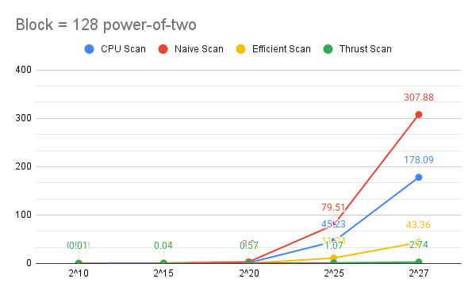
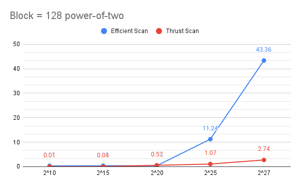
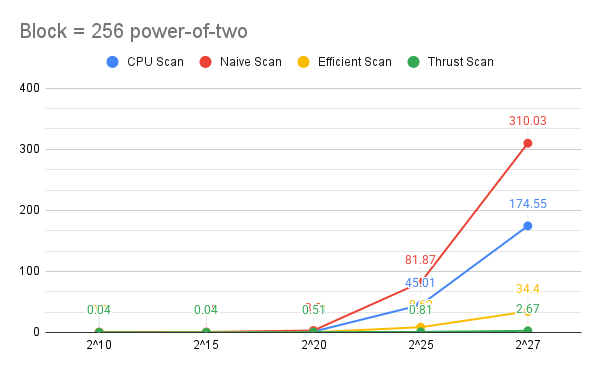
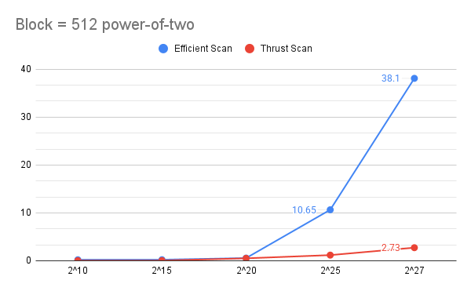

CUDA Stream Compaction
======================

**University of Pennsylvania, CIS 565: GPU Programming and Architecture, Project 2**

* Jiangman(Lobi) Zhao
  * [Lobi Zhao - LinkedIn](https://www.linkedin.com/in/lobizhao/), [Lobi Zhao - personal website](https://lobizhao.github.io/).
* Tested on: Windows 11 Pro, i5-10600KF @ 4.10GHz 32GB, RTX 3080 10GB

### Questions

**Part 5 Why is My GPU Approach So Slow?**

    At first, I noticed the CPU was actually beating the GPU in my tests. It turns out the problem was too much data being sent back and forth between them.

    So, I optimized my efficient.cu code by rewriting it to keep the data on the GPU as much as possible. The main goal of the fix was to make the whole map -> scan -> scatter process happen entirely on the GPU, so it doesn't have to send anything back to the CPU until the very end.

#### analysis
- block size **128** & const int SIZE: 2^10 - 2^27

<table>
  <tr>
    <td></td>
    <td></td>
  </tr>
</table>

- block size **256** & const int SIZE: 2^10 - 2^27

<table>
  <tr>
    <td></td>
    <td></td>
  </tr>
</table>

- block size **512** & const int SIZE: 2^10 - 2^27

<table>
  <tr>
    <td></td>
    <td></td>
  </tr>
</table>

#### output of the test program

    Test base on: 
    const int SIZE = 1 << 25;

    Included part 6  Radix sort 

    ****************
    ** SCAN TESTS **
    ****************
        [   0  20   7  46  36   4  11  40  20   1  48  31  30 ...   8   0 ]
    ==== cpu scan, power-of-two ====
      elapsed time: 45.1443ms    (std::chrono Measured)
        [   0   0  20  27  73 109 113 124 164 184 185 233 264 ... 821971619 821971627 ]
    ==== cpu scan, non-power-of-two ====
      elapsed time: 44.9316ms    (std::chrono Measured)
        [   0   0  20  27  73 109 113 124 164 184 185 233 264 ... 821971529 821971563 ]
        passed
    ==== naive scan, power-of-two ====
      elapsed time: 85.4253ms    (CUDA Measured)
        passed
    ==== naive scan, non-power-of-two ====
      elapsed time: 79.2795ms    (CUDA Measured)
        passed
    ==== work-efficient scan, power-of-two ====
      elapsed time: 11.382ms    (CUDA Measured)
        passed
    ==== work-efficient scan, non-power-of-two ====
      elapsed time: 11.0643ms    (CUDA Measured)
        passed
    ==== thrust scan, power-of-two ====
      elapsed time: 1.16448ms    (CUDA Measured)
        passed
    ==== thrust scan, non-power-of-two ====
      elapsed time: 1.19802ms    (CUDA Measured)
        passed

    *****************************
    ** STREAM COMPACTION TESTS **
    *****************************
        [   3   3   1   0   1   0   0   1   0   1   2   3   1 ...   1   0 ]
    ==== cpu compact without scan, power-of-two ====
      elapsed time: 66.0691ms    (std::chrono Measured)
        [   3   3   1   1   1   1   2   3   1   2   3   2   2 ...   3   1 ]
        passed
    ==== cpu compact without scan, non-power-of-two ====
      elapsed time: 66.1073ms    (std::chrono Measured)
        [   3   3   1   1   1   1   2   3   1   2   3   2   2 ...   2   3 ]
        passed
    ==== cpu compact with scan ====
      elapsed time: 66.3996ms    (std::chrono Measured)
        [   3   3   1   1   1   1   2   3   1   2   3   2   2 ...   3   1 ]
        passed
    ==== work-efficient compact, power-of-two ====
      elapsed time: 17.2911ms    (CUDA Measured)
        passed
    ==== work-efficient compact, non-power-of-two ====
      elapsed time: 16.4798ms    (CUDA Measured)
        passed

    *********************
    **Part 6: RADIX SORT TESTS **
    *********************
        [ 4603 22819 4453 32160 32601 22180 27724 1513 25032 27321 30250 11575 22369 ... 25677 25289 ]
    ==== radix sort ====
      elapsed time: 1089.62ms    (CUDA Measured)
        [   0   0   0   0   0   0   0   0   0   0   0   0   0 ... 32767 32767 ]
        passed

